# Additional Architecture Diagrams

This document contains additional architecture diagrams to complement the main project architecture diagrams and fill identified gaps.

## Table of Contents

1. [Pattern Comparison Matrix](#pattern-comparison-matrix)
2. [Data Flow Diagrams](#data-flow-diagrams)
3. [Implementation Roadmap](#implementation-roadmap)
4. [VPC Architecture](#vpc-architecture)
5. [IAM Permission Diagrams](#iam-permission-diagrams)
6. [Monitoring and Alerting](#monitoring-and-alerting)
7. [CI/CD Pipeline](#cicd-pipeline)
8. [Testing Strategy](#testing-strategy)
9. [Troubleshooting Flowcharts](#troubleshooting-flowcharts)

---

## Pattern Comparison Matrix

```mermaid
graph TB
    subgraph "Pattern Comparison Matrix"
        subgraph "Complexity Level"
            SIMPLE[Simple<br/>Low Complexity]
            MEDIUM[Medium<br/>Moderate Complexity]
            COMPLEX[Complex<br/>High Complexity]
        end
        
        subgraph "Cost Profile"
            LOW_COST[Low Cost<br/>Pay-per-request]
            MED_COST[Medium Cost<br/>Mixed pricing]
            HIGH_COST[Higher Cost<br/>More resources]
        end
        
        subgraph "Performance"
            FAST[Fast<br/>Low latency]
            MED_PERF[Medium<br/>Balanced]
            SCALABLE[Scalable<br/>Auto-scaling]
        end
        
        subgraph "Security"
            BASIC[Basic<br/>Standard security]
            ENHANCED[Enhanced<br/>WAF + encryption]
            COMPREHENSIVE[Comprehensive<br/>Multi-layer]
        end
    end
    
    subgraph "Patterns"
        AGDD[API Gateway<br/>Direct DynamoDB]
        AGLSS[API Gateway<br/>Lambda SNS SQS]
        ELASS[EventBridge<br/>Lambda API SNS SQS]
        RWCS[Route53 WAF<br/>CloudFront S3]
        AGMD[API Gateway<br/>Microservices<br/>DynamoDB]
    end
    
    AGDD --> SIMPLE
    AGDD --> LOW_COST
    AGDD --> FAST
    AGDD --> BASIC
    
    AGLSS --> MEDIUM
    AGLSS --> MED_COST
    AGLSS --> MED_PERF
    AGLSS --> ENHANCED
    
    ELASS --> COMPLEX
    ELASS --> MED_COST
    ELASS --> SCALABLE
    ELASS --> ENHANCED
    
    RWCS --> MEDIUM
    RWCS --> MED_COST
    RWCS --> FAST
    RWCS --> COMPREHENSIVE
    
    AGMD --> COMPLEX
    AGMD --> HIGH_COST
    AGMD --> SCALABLE
    AGMD --> COMPREHENSIVE
    
    style AGDD fill:#e1f5fe
    style AGLSS fill:#f3e5f5
    style ELASS fill:#e8f5e8
    style RWCS fill:#fff3e0
    style AGMD fill:#fce4ec
```

---

## Data Flow Diagrams

### API Gateway Direct DynamoDB Data Flow

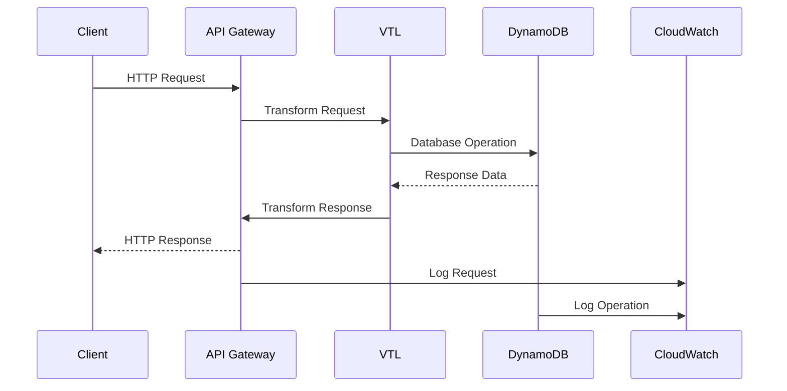

### API Gateway Lambda SNS SQS Data Flow

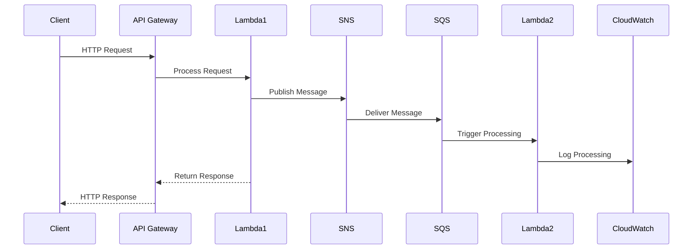

### EventBridge Lambda API SNS SQS Data Flow

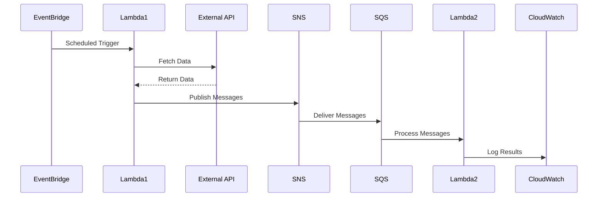

---

## Implementation Roadmap

```mermaid
graph TB
    subgraph "Implementation Phases"
        subgraph "Phase 1: Foundation"
            P1_1[Choose Pattern]
            P1_2[Set Up AWS Account]
            P1_3[Configure Terraform]
        end
        
        subgraph "Phase 2: Core Infrastructure"
            P2_1[Deploy Base Resources]
            P2_2[Configure Security]
            P2_3[Set Up Monitoring]
        end
        
        subgraph "Phase 3: Application Layer"
            P3_1[Deploy Application]
            P3_2[Configure APIs]
            P3_3[Test Functionality]
        end
        
        subgraph "Phase 4: Production"
            P4_1[Performance Testing]
            P4_2[Security Review]
            P4_3[Go Live]
        end
    end
    
    subgraph "Migration Paths"
        M1[Start Simple<br/>API Gateway Direct DynamoDB]
        M2[Add Complexity<br/>Lambda Processing]
        M3[Scale Up<br/>Microservices]
        M4[Global Distribution<br/>CloudFront + WAF]
    end
    
    P1_1 --> P1_2
    P1_2 --> P1_3
    P1_3 --> P2_1
    P2_1 --> P2_2
    P2_2 --> P2_3
    P2_3 --> P3_1
    P3_1 --> P3_2
    P3_2 --> P3_3
    P3_3 --> P4_1
    P4_1 --> P4_2
    P4_2 --> P4_3
    
    M1 --> M2
    M2 --> M3
    M3 --> M4
    
    style M1 fill:#e1f5fe
    style M2 fill:#f3e5f5
    style M3 fill:#e8f5e8
    style M4 fill:#fff3e0
```

---

## VPC Architecture

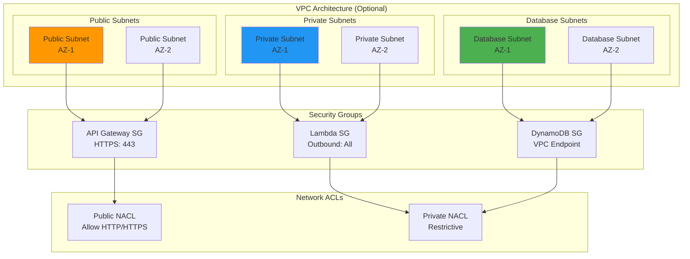

---

## IAM Permission Diagrams

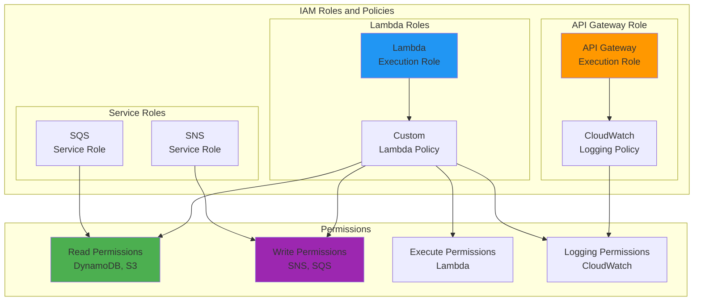

---

## Monitoring and Alerting

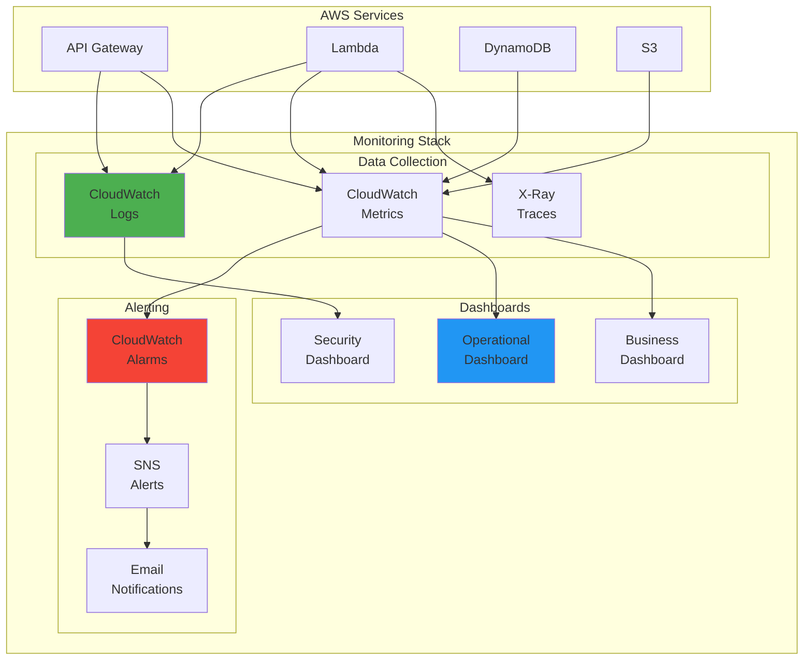

---

## CI/CD Pipeline

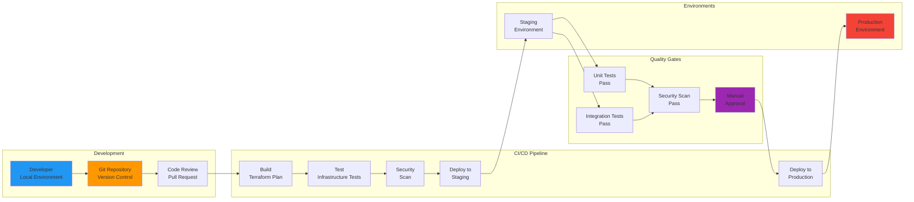

---

## Testing Strategy

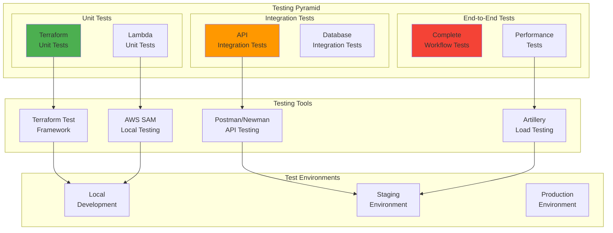

---

## Troubleshooting Flowcharts

### API Gateway Issues

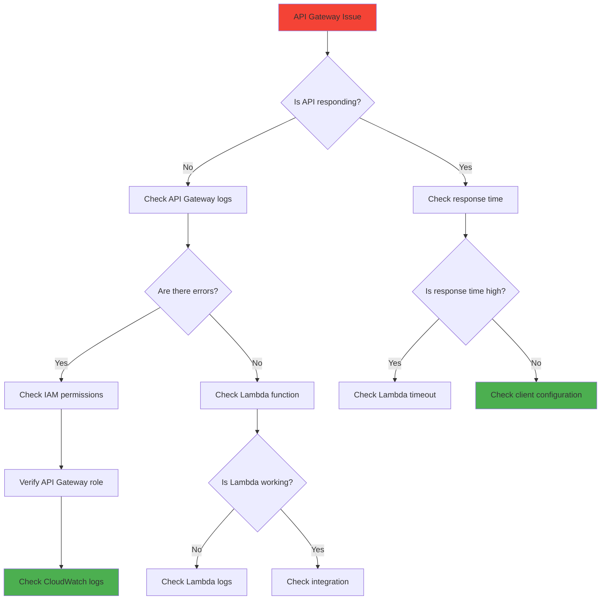

### DynamoDB Issues

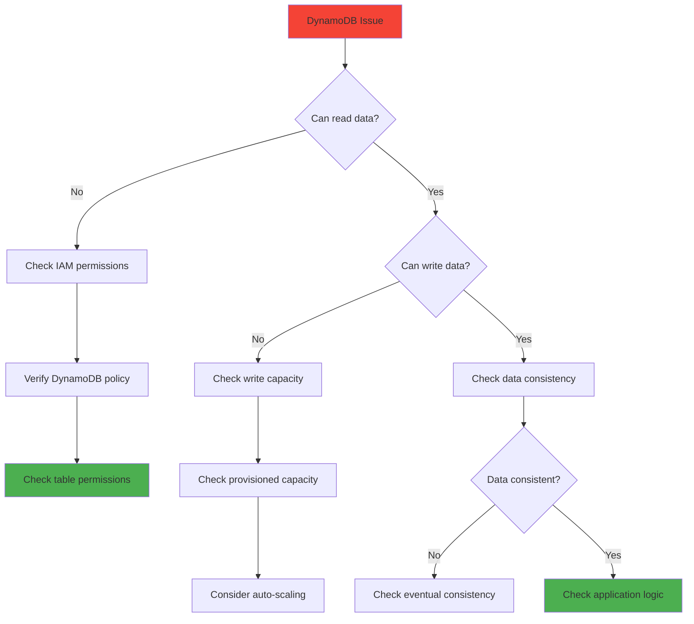

---

## Conclusion

These additional architecture diagrams provide:

1. **Pattern Selection Guidance**: Comparison matrix helps choose the right pattern
2. **Implementation Clarity**: Data flow diagrams show how components interact
3. **Operational Excellence**: Monitoring, CI/CD, and testing strategies
4. **Troubleshooting Support**: Flowcharts for common issues
5. **Security Understanding**: IAM and VPC architecture details

Together with the main architecture diagrams, this creates a comprehensive showcase of AWS Solutions Architecture capabilities.
